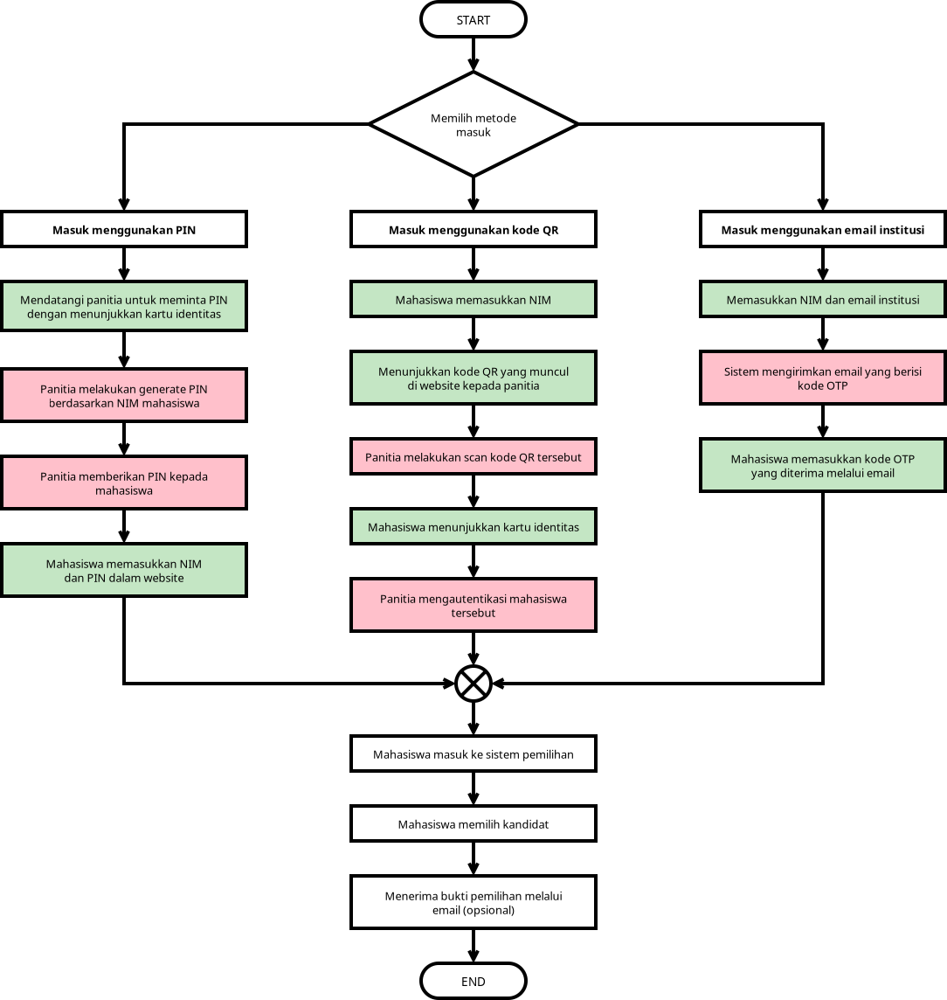
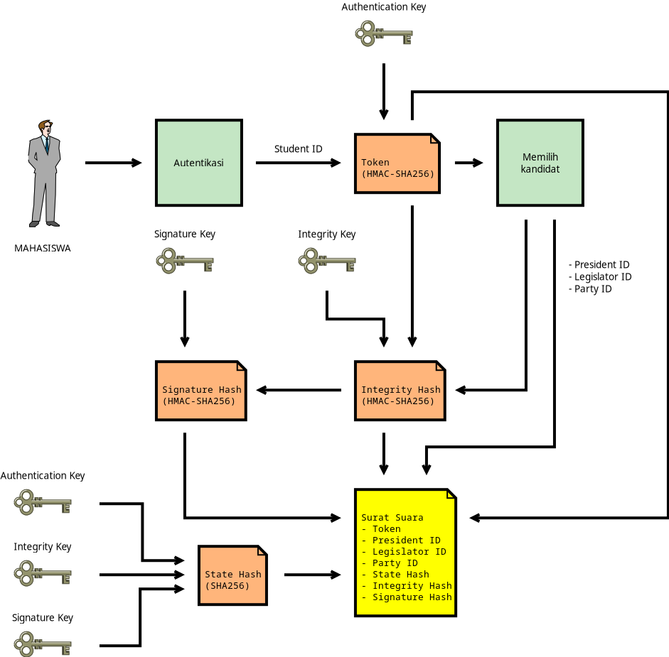

# Arsitektur E-voting PRESMA

## Voting

- Mahasiswa dapat masuk ke dalam sistem melalui 3 metode autentikasi, yaitu: **PIN**, **kode QR**, dan **email institusi**
- Apabila menggunakan **PIN** dan **kode QR**, mahasiswa diperlukan untuk datang ke lokasi pemilihan (dilakukan secara *offline*) untuk menunjukkan kartu identitas dan berinteraksi dengan panitia
- Apabila menggunakan **email institusi**, mahasiswa tidak perlu mendatangi lokasi pemilihan (dilakukan secara *online*) dan tidak perlu menunjukkan kartu identitas
    - Kepemilikan e-mail institusi beserta terregistrasinya mahasiswa tersebut sebagai DPT sudah cukup untuk membuktikan identitasnya
    - Karena e-mail institusi tidak bisa dibuat dengan bebas (umumnya hanya pada saat awal masuk menjadi mahasiswa baru, satu mahasiswa memiliki satu e-mail institusi), maka potensi tindakan penyalahgunaan seperti penggandaan / penggelembungan suara dapat diminimalisir
- Pemilihan metode autentikasi disesuaikan dengan situasi dan kondisi perguruan tinggi masing-masing

## Keamanan

- Terdapat tiga kunci yang wajib dijaga kerahasiaannya: **authentication key**, **integrity key**, dan **signature key**
- **Authentication key** berguna untuk menciptakan *token* unik untuk setiap pemilih supaya dapat diidentifikasi oleh sistem e-voting
    - *Token* merupakan identitas unik tiap mahasiswa dan satu *token* tidak diperbolehkan memiliki dua atau lebih suara
    - Kunci ini wajib dirahasiakan karena menyimpan informasi korespondensi antara mahasiswa dan surat suara
    - Apabila kunci ini tersebar, maka terdapat risiko pihak yang tidak bertanggung jawab untuk **mengetahui pilihan kandidat** dari masing-masing mahasiswa, apabila mengetahui ID (bukan NIM) dari mahasiswa yang bersangkutan
- **Integrity key** berguna untuk menjaga integritas surat suara supaya tidak dimanipulasi oleh pihak yang tidak bertanggung jawab (misal mengubah pilihan capres)
    - Kunci ini wajib dirahasiakan **sebelum** pengumuman hasil pemilihan
    - Setelah pengumuman hasil pemilihan, kunci ini **dapat dipublikasikan** supaya publik juga dapat turut serta memverifikasi integritas / keabsahan setiap surat suara
- **Signature key** memiliki peran yang sama dengan *integrity key*, namun perbedaannya adalah kunci ini **tidak boleh dipublikasikan** karena merupakan pelindung terakhir apabila kunci integritas bocor atau terdapat manipulasi hasil setelah publikasi kunci integritas
    - Apabila kunci ini tersebar, bersamaan dengan *integrity key*, maka terdapat risiko manipulasi kotak suara (penggandaan suara dan perubahan isi surat suara)
- Terdapat juga **State Hash** yang berguna untuk merepresentasikan keadaan dari ketiga kunci rahasia
    - Apabila salah satu kunci diubah, maka surat suara sudah tidak dapat lagi dinyatakan sah
    - Jika **authentication key** diubah, terdapat risiko penggandaan suara (mahasiswa yang sama melakukan voting dua kali atau lebih menggunakan identitas yang sama namun dengan *token* yang berbeda)
    - Jika **integrity key** atau **signature key** diubah, hal tersebut menyebabkan sistem tidak bisa membedakan mana suara yang sah (setelah perubahan kunci) dan tidak sah (sah sebelum perubahan kunci)
- Apabila terjadi kebocoran kunci atau keamanan telah terjadi *compromise* di tengah berjalannya pemilihan, maka operator IT **diwajibkan** untuk mengevaluasi keamanan sistem, **mengubah** ketiga kunci rahasia, serta **mereset** seluruh data surat suara yang masuk ke sistem dan mengadakan pemungutan suara ulang
