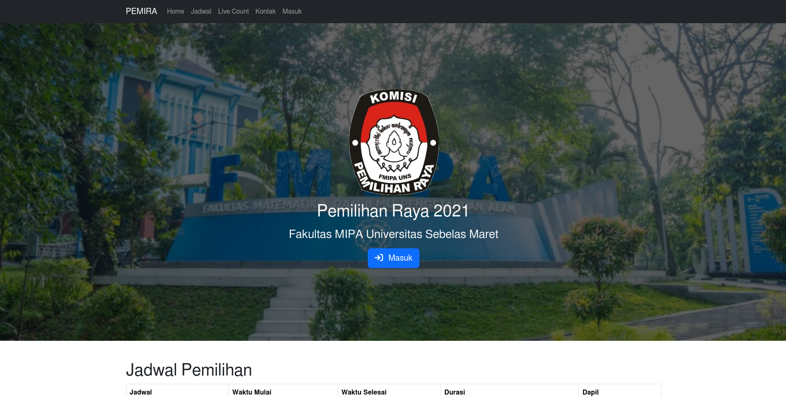
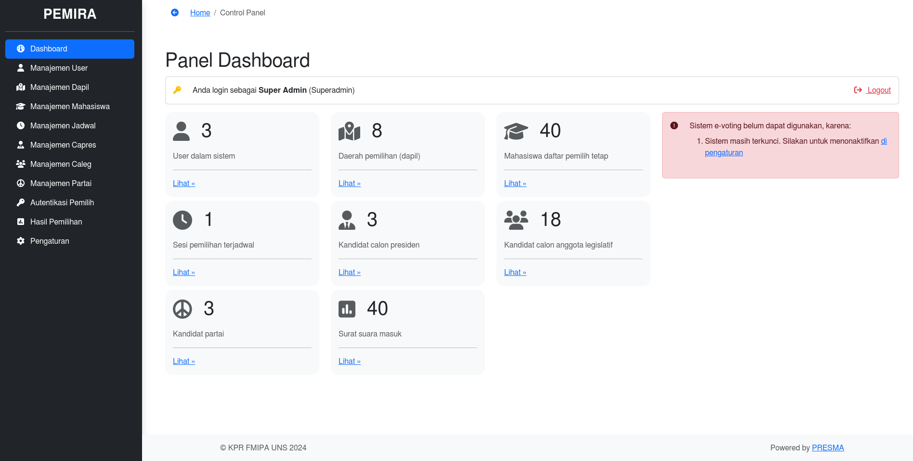
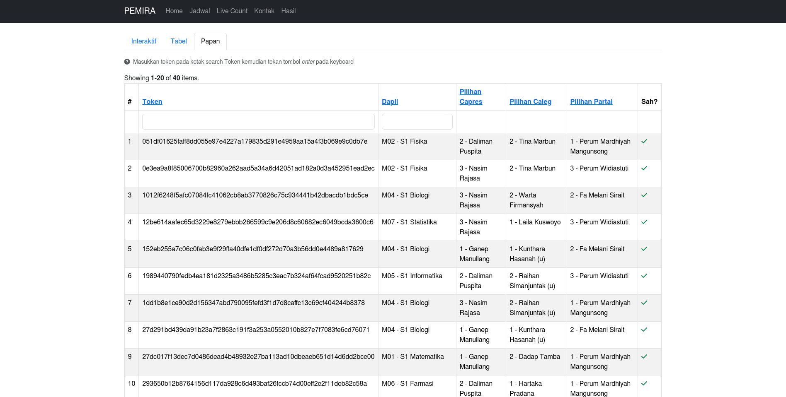

---
hide:
  - navigation
  - toc
---

# PRESMA

## Apa itu PRESMA?

**PRESMA** (nama diambil dari singkatan *Presiden Mahasiswa*) adalah sebuah aplikasi berbasis web yang ditujukan untuk melayani kebutuhan e-voting khususnya di lingkungan perguruan tinggi dalam rangka Pemilihan Raya (PEMIRA) untuk memilih calon presiden BEM periode berikutnya. Tidak hanya digunakan pada saat pemilihan presiden BEM, **PRESMA** juga dapat digunakan untuk memilih ketua Himpunan Mahasiswa Jurusan (HMJ), ketua UKM, ketua DEMA, bahkan ketua angkatan, dan lain sebagainya.

## Mengapa Harus PRESMA?

Salah satu keunggulan dari **PRESMA** dibandingkan sistem e-voting yang lain adalah **PRESMA** memungkinkan publik untuk dapat turut serta memverifikasi keabsahan surat suara yang masuk ke dalam sistem. **PRESMA** menggunakan teknologi kriptografi untuk melindungi integritas surat suara supaya tidak dapat dimanipulasi oleh pihak yang tidak bertanggung jawab. Selain itu, manajemen sumber daya yang terdapat dalam aplikasi web ini dirancang khusus supaya memudahkan panitia penyelenggara dalam mengoperasikannya. Dengan demikian, pemilihan umum dapat berjalan secara aman, transparan, rahasia, dan efektif, sesuai dengan prinsip luber jurdil pemilu pada umumnya.

Berikut adalah daftar fitur unggulan dari aplikasi **PRESMA**:

- Menjunjung tinggi transparansi pemilu dengan mempublikasikan isi kotak suara untuk dapat diverifikasi oleh umum
- Tema aplikasi yang dapat dikustomisasi sesuai selera (disediakan oleh [Bootswatch](https://bootswatch.com/))
- Pemilihan umum dapat diselenggarakan baik secara *offline*, *online*, maupun campuran dari keduanya (*hybrid*)
- Tiga metode masuk / autentikasi untuk memudahkan mahasiswa dalam memilih: menggunakan **PIN**, menggunakan **scan kode QR**, dan menggunakan **e-mail institusi**
- Panitia dapat melakukan *import* data mahasiswa DPT dari file Excel/Spreadsheet untuk menghemat waktu dan tenaga
- Teknologi kriptografi [HMAC-SHA256](https://en.wikipedia.org/wiki/HMAC) untuk melindungi integritas surat suara yang masuk, mencegah manipulasi pihak eksternal
- Dapat memilih kandidat calon presiden, calon anggota legislatif, dan partai
- Distribusi hak akses antara panitia pemilihan raya (super admin, admin, dan operator)
- *User Interface* (UI) yang ramah untuk perangkat *mobile*

Galeri screenshot dalam aplikasi dapat dilihat [di sini](screenshots.md).

## Tertarik Menggunakan?

Silakan [hubungi kami](contact.md) apabila Anda, sebagai penyelenggara pemilihan raya, tertarik untuk menggunakan jasa kami dalam menyediakan layanan e-voting.

Kami juga menyediakan [gambaran arsitektur sistem](architecture.md) dan [panduan penggunaan](guide.md) untuk membantu Anda lebih memahami dan mahir mengoperasikan sistem e-voting kami.
